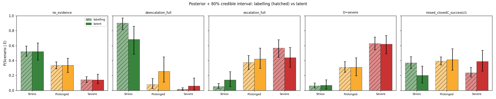
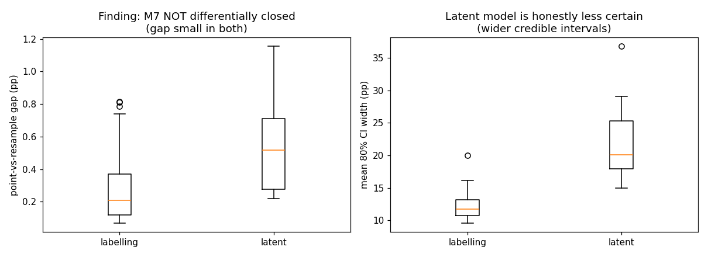
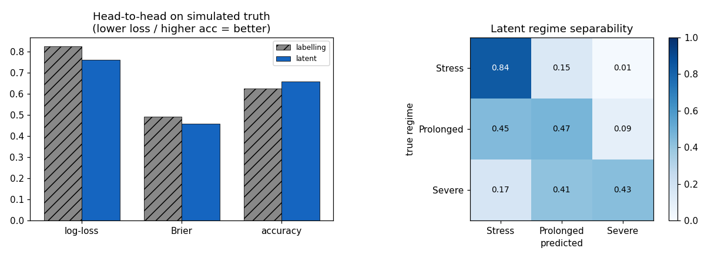

# Latent-Regime vs Labelling: Topology Comparison

> Auto-generated by `scripts/compare_topologies.py`. Companion to [docs/01_latent_regime_plan.md](01_latent_regime_plan.md). The latent-regime model is built with `build_network("latent_regime")`; the labelling model (`build_network()`) is retained as the comparison baseline.

## Three headline findings

**1. The labelling model is structurally blind to upstream context *once outcomes are observed*.** This is a conditional statement, not "upstream never matters": if the outcomes are *unobserved*, changing an upstream node shifts (D,T,P) and hence `P(S)` in **both** models identically. But once (D,T,P) are observed, `Scenario`'s Markov blanket is exactly {D,T,P}, so adding upstream evidence on top changes nothing in the labelling model (the latent model still updates, e.g. severe outcomes in a benign military context shift mass toward Prolonged). In the head-to-head below the labelling model scores **identically** on *emissions only* vs *all observables* (0.827 log-loss both), while the latent model improves (0.782 → 0.764). This is the single clearest argument for the reframe.

**2. The labelling model is overconfident; the latent model is honestly uncertain.** On full de-escalation the labelling model reports [0.903, 0.081, 0.016] (≈90% Stress) vs the latent model's [0.683, 0.262, 0.055] (≈68% Stress). The latent model's credible intervals are also wider on average (21.5pp vs 12.3pp) — the labelling model's narrow CIs are false precision.

**3. Finding M7 is NOT closed by the reframe.** The plan hypothesised the point-vs-resample-mean gap would shrink under the latent model. It does not: the gap is small in *both* models (95th-pctile labelling 0.81pp, latent 0.96pp) and is not smaller for the latent model. M7 is a small, model-agnostic Jensen artefact, correctly handled by plotting the resample-mean.

## Where the two models agree exactly (correctness of the anchor derivation)

The latent CPTs are exact conditionals of the current joint, so the two models agree to machine precision on the prior, on damage-evidence `P(S|D)`, on `P(S|M)`, and on the joint `P(S,D,M,C)`. They diverge only where the topology genuinely differs (duration, path, upstream evidence).

Largest divergences (L1 over the scenario simplex):

| config | labelling | latent | L1 |
|---|---|---|---|
| deescalation_full | [0.903, 0.081, 0.016] | [0.683, 0.262, 0.055] | 0.440 |
| U1=success | [0.761, 0.182, 0.058] | [0.568, 0.318, 0.114] | 0.385 |
| deescalation_partial | [0.844, 0.129, 0.027] | [0.658, 0.278, 0.064] | 0.373 |
| mixed_closedC_successU1 | [0.373, 0.392, 0.235] | [0.195, 0.412, 0.393] | 0.355 |
| contradict_severeD_openP | [0.151, 0.452, 0.397] | [0.110, 0.322, 0.568] | 0.341 |
| U1=breakdown | [0.310, 0.456, 0.235] | [0.475, 0.353, 0.172] | 0.331 |

## Expressiveness: the two knobs the latent topology adds

- **Bayes factors stay finite.** On `E={D=severe}`, the hard labelling limit gives `P(D=severe|Stress)=0` → Λ(Severe,Stress) = ∞ (degenerate); the latent model gives `P(D=severe|Stress)=0.012` → Λ = 36.3, finite and interpretable.

- **Independent regime prior.** `P(S|M,C)` is a primitive you can set; the labelling model has no such parameter (its scenario prior is induced by the outcome marginal × partition).

- **Multiplicative composition.** Conditional on a full context, latent emissions compose exactly: Λ(D,P)=Λ(D)·Λ(P).

## Head-to-head calibration on simulated ground truth

Simulated regime mix: {'Stress': 0.532, 'Prolonged': 0.331, 'Severe': 0.137}.

| evidence | model | log-loss | Brier | accuracy |
|---|---|---|---|---|
| emissions | labelling | 0.8269 | 0.4932 | 0.6247 |
| emissions | latent | 0.7824 | 0.4701 | 0.6453 |
| all_observables | labelling | 0.8269 | 0.4932 | 0.6247 |
| all_observables | latent | 0.7636 | 0.4579 | 0.6590 |

*Caveat:* data are generated by the latent model, so this presupposes the semantic commitment that regimes are real generative causes (see the domain judgement below). Under that assumption it quantifies the labelling coarsening's miscalibration.

## Domain-judgement unit (the licensing test no statistic can settle)

Whether the latent topology is *genuinely* superior rests on a domain judgement: do the scenarios name real regimes that co-drive outcomes, or are they just outcome buckets? The data-driven evidence **informs but does not settle** it:

- mutual information I(S; D,T,P) = **0.28 bits** (20% of H(S)=1.422)
- Bayes-optimal regime separability from outcomes = **0.651**
- pairwise regime overlap (1−TV): {'Stress vs Prolonged': 0.602, 'Stress vs Severe': 0.361, 'Prolonged vs Severe': 0.648}
- off-mode mass per regime: {'Stress': 0.767, 'Prolonged': 0.947, 'Severe': 0.86}

Interpretation: moderate MI / separability with substantial off-mode mass is consistent with **real but overlapping** regimes (especially the weak middle regime) — supportive of, but not proof of, the generative reading. **Status: EXPERT_INPUT_REQUIRED.** The expert must affirm (i) the scenarios are real regimes, (ii) outcome/regime overlap is acceptable, (iii) permanent latency is acceptable. If they do, every check above licenses the reframe; if they say these are mere buckets, the labelling model is the honest region-probability.
