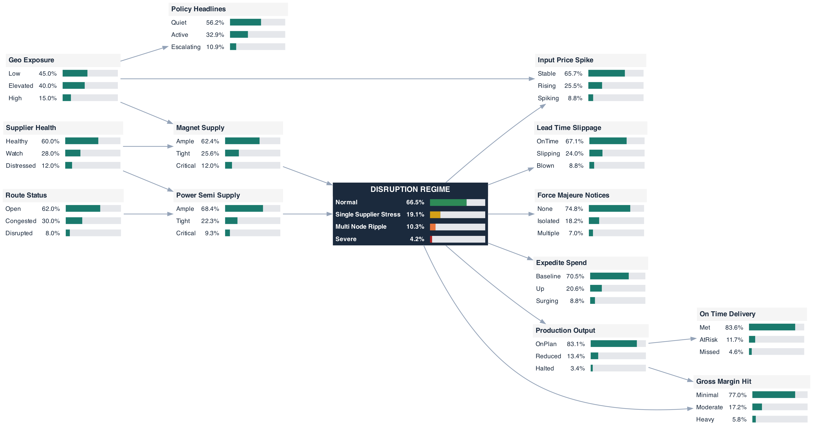
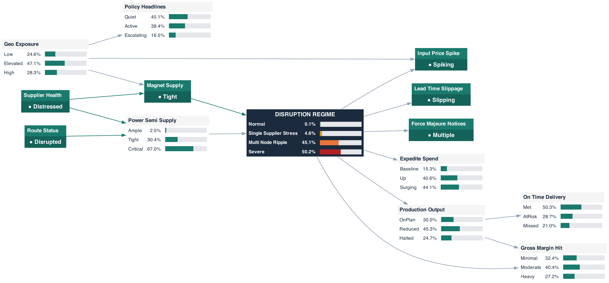

# Meridian Drive Systems — A Supply-Chain Disruption Bayesian Network

*A worked, end-to-end example of the scenario-as-latent BN method applied to a
corporate decision. This is the "central" demo pack alongside Hormuz.*

---

## 1. What this is, in one paragraph

Meridian Drive Systems is a (fictional, representative) ~\$2.5 B maker of
electric-vehicle traction motors. Its production depends on two structurally
fragile inputs — **rare-earth permanent magnets** (NdFeB, dysprosium/terbium) and
**power semiconductors** (SiC/IGBT modules). A disruption to either can idle a
motor line within weeks. The question the business needs answered, continuously,
is: *"Given the noisy stream of headlines, supplier notices, and price ticks
we're seeing this week, how disrupted is our supply network actually getting —
and what will it do to deliveries and margin?"*

We answer it with a **Bayesian network whose central node is a hidden
"Disruption Regime."** We never observe the regime directly; we infer it from
observable signals, and we propagate that inference forward to the P&L
consequences a COO or CFO actually acts on. The conditional probability tables
(CPTs) are **elicited from experts**, not trained from data, because the
situation is novel and data-poor (Section 4).

---

## 2. The business case, end to end

This is the whole argument in one place: the questions an executive needs
answered, why the raw data alone can't answer them, how the network does, how it
is **calibrated** (the part that makes or breaks it), and what comes out.

### 2.1 The questions the executives actually want answered

Meridian's COO and CFO do not want a data lake; they want decisions. Every week —
and on any bad-news day — they are asking five questions:

1. **How exposed are we *right now*?** Is this week's noise a blip, or the start of
   a magnet / power-semi crunch that idles a motor line? Give me *one* number, with
   honest uncertainty — not eight dashboards.
2. **Where is the problem?** Magnets or power semiconductors? One supplier or the
   whole tier? So we know *which* lever to pull.
3. **What will it cost, and when?** What does this do to buildable units, on-time
   delivery to our OEM customers, and gross margin over the next few weeks?
4. **Should we act now, and how hard?** Acting early burns working capital on
   safety stock and premium freight; acting late means a line-down (millions/week)
   and contractual late-delivery penalties. Where is the line *today*?
5. **Can we defend the call?** When we ask the board for \$20 M of contingency
   inventory, can we show a calibrated, auditable basis — not a gut feel?

Those five questions are the spec. Everything below exists to answer them.

### 2.2 The data on the table — and why no single feed decides anything

Meridian is not data-poor in the raw sense; it is **signal-poor**. It has many
feeds, each individually *necessary but insufficient*:

| Feed | Frequency | What it tells you | Why it can't decide alone |
|---|---|---|---|
| ERP lead-times (PO promise vs. request) | Daily | Deliveries are slipping | **Lagging** — by the time the ERP shows blown lead-times the crisis is weeks old; and one late PO ≠ a crisis |
| Supplier force-majeure notices | Event | A supplier formally can't deliver | Binary and late; says nothing about *magnitude*, *spread*, or what it does to *you* |
| Magnet / SiC price indices, spot quotes | Daily / intraday | Input costs are moving | Prices also move on macro speculation — a spike may be *the market*, not *your* disruption (explaining-away) |
| Premium / air-freight & expedite spend | Weekly | You're already paying to recover | Pure **lagging** confirmation — you're already in trouble |
| Supplier credit / financial health | Weekly / monthly | A supplier is weakening | A standing risk, not a trigger; most weak suppliers don't fail *this* quarter |
| Port-congestion / freight indices | Daily | Lanes are clogged | Macro and shared; congestion ≠ *your* parts are stuck |
| News / policy headlines | Continuous | The earliest warning (export controls, sanctions) | Unstructured, noisy, not yet operational — a threat, not a confirmed hit |

Read any one alone and you either **over-react** (every price tick or single late
PO looks like a fire) or **under-react** (wait for the ERP to confirm — by which
point the line is already starving). The feeds sit at **different latencies** (news
leads by weeks; expedite spend lags), **different reliabilities** (a force-majeure
notice is hard; a headline is soft), and **different scopes** (macro vs.
Meridian-specific). No human fuses seven mismatched streams into a consistent,
calibrated judgement several times a week — let alone one they can defend to a
board. *That is the gap.*

### 2.3 How the BN solves it — and how it is calibrated

**The solve, in one sentence:** the network treats the seven feeds as noisy
*evidence* about a hidden **Disruption Regime**, fuses whatever is currently
observed (across latencies, reliabilities and scopes) into one posterior, and
propagates it to the business consequences. It does three things a weighted
average or a RAG dashboard cannot: it **infers the unobservable** (the regime, the
failing bottleneck, the margin hit — none of which is in any feed); it **handles
partial, conflicting evidence** (two feeds today, five silent; a hard notice vs. a
soft headline, weighed by how diagnostic each is); and it **explains away** (a
price spike under high geopolitical exposure is discounted as possibly-macro, so
you don't cry wolf on market noise).

**But all of that is worthless if the numbers are wrong — calibration *is* the
product.** A Bayesian network with bad CPTs is just a confident liar. Calibration
here is a *defined program with a pass/fail test*, not an asterisk:

1. **Make it cheap to do.** The ranked-node parameterization means an expert gives
   a few weights and anchor distributions per node, not hundreds of cells — the
   whole network is *tens* of judgements. Skip this and no busy category manager
   ever finishes.
2. **Anchor to data wherever it exists.** Driver base rates come from the credit
   and freight feeds; the emission models P(signal | regime) are seeded from
   Meridian's **own** history — replay the quarters you can label "normal" vs.
   "stressed" and measure how lead-times, prices and notices actually behaved.
   Elicitation *refines* these priors; it doesn't invent from nothing.
3. **Elicit the rest with a calibrated protocol, not a meeting.** A 3–6-person
   panel answers seed questions whose answers are known (drawn from Meridian's past
   disruptions). Accuracy on those seeds sets a **calibration weight κ** (Cooke's
   classical model) that down-weights the overconfident — turning "expert opinion"
   into a defensible weighted aggregate.
4. **Prove it by backtesting.** Replay the last several real disruptions: did the
   regime posterior rise *in time*, before the line went down? Score it
   (Brier / log-loss). **A tool that would have called your last three disruptions
   two weeks early is the entire sales argument** — and what you show the board. Fail
   the backtest and you fix the CPTs *before* trusting it.
5. **Keep it honest.** CPTs are versioned and owned; every real event is a
   post-mortem ("were we calibrated?"); κ tracks who stays reliable; and as
   labelled episodes accumulate the CPTs update from elicited prior toward data.
   Day one it runs on judgement and earns data-driven corrections over time —
   without ever needing the big clean dataset ML demands up front.

*(Section 5 has the full mechanics. The point here: without this program there is
nothing to talk about — it is the difference between a tool and a slide.)*

### 2.4 The outputs, and the business value

What comes out — updated continuously, each with an 80% credible interval:

- **A regime probability**, *Normal → Severe* — the one number for "how bad,"
  fusing all evidence (in the Section 6 example it climbs 4% → 50% over three
  headlines).
- **A diagnosis** — which bottleneck (magnet vs. power-semi), and whether a signal
  is real or explained-away.
- **A P&L prognosis** — the expected hit to **production output, on-time delivery,
  and gross margin** (margin-Heavy 6% → 27% in the same example).
- **Alerts** when the regime, or the *uncertainty*, crosses a threshold.

The value is the **decision** each output unlocks — mapped straight back to §2.1:

| Executive question | What the output gives them | The value |
|---|---|---|
| How exposed, right now? | Calibrated P(regime) + interval | Act on one honest number, not eight dashboards or a gut call |
| Where is the problem? | Mechanism diagnosis | Pull the *right* lever — which part/supplier to pre-buy or dual-source |
| What will it cost, when? | Production / delivery / margin posteriors | Size the response in units and dollars; set the contingency reserve |
| Act now, how hard? | Early regime shift from *leading* signals | Buy lead-time: act before the ERP confirms — avoid line-down *and* avoid over-spending on false alarms |
| Can we defend it? | Auditable graph + κ + backtest | A board-grade basis for a capital ask, not opinion |

The quantified hook: **one avoided line-down week, or one avoided OEM late-delivery
penalty, typically pays for the tool many times over.** The asset is *calibrated
early warning with a quantified consequence* — on exactly the events where
historical / ML models are blind and a human can't fuse the signals fast enough.

---

## 3. Why a Bayesian network and not machine learning

This is the core sales argument and it is worth stating crisply. A fitted
statistical / ML model needs a large sample of *labelled, comparable* historical
episodes. Severe, structurally-novel supply shocks do not provide that:

- **The events are rare and non-stationary.** The 2010–11 rare-earth quota shock,
  the 2021 auto-chip shortage, the Ever Given, COVID container chaos — a handful
  of episodes, each structurally different, none a clean repeat of the next. You
  cannot fit a model that generalises from `n ≈ 5` non-comparable events.
- **The drivers are reflexive and policy-driven** (export controls, sanctions,
  force-majeure declarations) — exactly the regime-change behaviour that breaks
  models trained on a "normal" past.
- **The cost of being wrong is asymmetric and large**, so you need *calibrated
  uncertainty*, not a point prediction.

Expert elicitation is the only credible source of the numbers, and a Bayesian
network is the natural container for elicited knowledge: it makes the causal
structure explicit, lets experts reason about *small, local* conditional
probabilities (which humans are far better at than joint ones), and produces a
full posterior with credible intervals. **Data-poor + high-stakes +
fast-moving = elicited BN beats data-hungry ML.** That sentence is the talk.

---

## 4. The model: a four-layer DAG

The network is deliberately **not** a flat "naive-Bayes star" (one hidden node
with a fan of independent symptoms). It is a four-layer causal DAG, because the
depth is what makes it a *Bayesian network* rather than a hidden-node classifier,
and because each layer earns its place.



```
LAYER 1  DRIVERS        Geo_Exposure   Supplier_Health   Route_Status
                             │   ╲           │    ╲           │
LAYER 2  MECHANISMS       Magnet_Supply ◄────┴────► Power_Semi_Supply
                                  ╲                 ╱
LAYER 3  LATENT REGIME         Disruption_Regime  (Normal → Severe)
                            ╱     │      ╲              ╲
LAYER 4a EMISSIONS   LeadTime  ForceMaj  Expedite   Input_Price_Spike ◄── Geo_Exposure
         (signals)                                   (explaining-away)
LAYER 4b IMPACTS     Production_Output → On_Time_Delivery     Gross_Margin_Hit
         (the P&L)                                            ↑ Production_Output

         INDICATOR   Policy_Headlines ◄── Geo_Exposure
```

### 4.1 The nodes, layer by layer

**Layer 1 — Drivers (exogenous root causes).** The slow-moving conditions that
set the stage. These are the *priors* of the model.

| Node | States | Meaning |
|---|---|---|
| `Geo_Exposure` | Low / Elevated / High | Geopolitical pressure on critical inputs — export-control regime, tariffs, sanctions on rare earths. |
| `Supplier_Health` | Healthy / Watch / Distressed | Financial condition of Meridian's critical suppliers (credit, liquidity, default risk). |
| `Route_Status` | Open / Congested / Disrupted | State of the inbound logistics lanes/ports that carry magnets and power-semis. |

**Layer 2 — Mechanisms (the two bottlenecks).** This is the depth a star graph
lacks. Drivers do **not** wire straight into the regime; they act *through* the
two component bottlenecks that actually constrain an EV-motor line.

| Node | States | Meaning | Parents |
|---|---|---|---|
| `Magnet_Supply` | Ample / Tight / Critical | Availability of rare-earth magnets. | `Geo_Exposure` (dominant), `Supplier_Health` |
| `Power_Semi_Supply` | Ample / Tight / Critical | Availability of power semiconductors. | `Route_Status` (dominant), `Supplier_Health` |

`Supplier_Health` is a **shared parent** of both mechanisms — a distressed
supplier tightens both bottlenecks at once, coupling them. This is a genuine
common-cause structure the model can reason about.

**Layer 3 — The latent regime (what we infer).**

| Node | States | Meaning |
|---|---|---|
| `Disruption_Regime` | Normal / Single_Supplier_Stress / Multi_Node_Ripple / Severe | The hidden state of the whole supply network. Never observed directly. |

- **Normal** — operating within tolerance; monitor only.
- **Single-supplier stress** — one critical supplier/lane under strain; localised.
- **Multi-node ripple** — disruption propagating across multiple suppliers/lanes.
- **Severe** — production-stopping shortages, force-majeure clustering, surging
  expedite spend.

**Layer 4a — Emissions (the observable signals).** These are the only nodes the
**translator sets evidence on** — the "read surface" an analyst feeds. They are
*effects* of the regime (the arrows point *out* of the latent node), which is
what lets observing them update belief about the hidden cause.

| Node | States | The headline it reads |
|---|---|---|
| `Lead_Time_Slippage` | OnTime / Slipping / Blown | Supplier lead-time movements. |
| `Force_Majeure_Notices` | None / Isolated / Multiple | Count/clustering of force-majeure declarations. |
| `Input_Price_Spike` | Stable / Rising / Spiking | Spot/contract price moves on magnets and power-semis. |
| `Expedite_Spend` | Baseline / Up / Surging | Premium- and air-freight spend to recover schedule. |

**Layer 4b — Impacts (the P&L consequences).** These are *also* effects of the
regime, but they are the **business outcomes** — the "so what." They are inferred
(not observed): the model tells you what the current regime implies for them.
This is the layer that turns an abstract regime probability into a number a CFO
acts on.

| Node | States | Meaning | Parents |
|---|---|---|---|
| `Production_Output` | OnPlan / Reduced / Halted | Buildable motor volume vs. plan. | `Disruption_Regime` |
| `On_Time_Delivery` | Met / AtRisk / Missed | OEM-customer delivery performance (→ penalties). | `Production_Output` |
| `Gross_Margin_Hit` | Minimal / Moderate / Heavy | Margin erosion from expedite premiums, price spikes, and fixed-cost under-absorption on lost volume. | `Disruption_Regime`, `Production_Output` |

**Indicator (cause-side signal).**

| Node | States | Meaning | Parent |
|---|---|---|---|
| `Policy_Headlines` | Quiet / Active / Escalating | Volume/tone of policy headlines — a *driver* indicator, letting the translator update the cause side directly. | `Geo_Exposure` |

### 4.2 What the structure buys (and a star can't)

The edges are not decoration; each non-trivial one demonstrates a capability:

1. **Mechanism / depth.** `drivers → mechanisms → regime`. The model reasons at
   the level of *named component bottlenecks*, not an undifferentiated blob. You
   can ask "is this a magnet problem or a power-semi problem?" and the posterior
   answers it.

2. **Common cause / coupling.** `Supplier_Health → {Magnet_Supply,
   Power_Semi_Supply}`. One distressed supplier raises both bottleneck
   probabilities together.

3. **Explaining-away.** `Input_Price_Spike` has **two** parents —
   `Disruption_Regime` *and* `Geo_Exposure`. Input prices also move with macro
   rare-earth pricing, independent of Meridian's own disruption. So a price spike
   observed when geopolitical exposure is already high is *partly explained by
   geo* and implicates the regime **less**. Quantitatively, a spike raises
   `P(disrupted)` by **+0.25** when `Geo_Exposure = Low`, but only **+0.23** when
   `Geo_Exposure = High` — the textbook explaining-away signature, which a
   naive-Bayes star (where every symptom is conditionally independent given the
   latent) structurally cannot produce.

4. **Diagnostic + predictive flow in one model.** Feed *signals* (4a) to infer
   the regime; read *impacts* (4b) to price the consequences. The same network
   does both directions of reasoning.

The deliberately **omitted** edges are documented too (e.g. `Supplier_Health →
Disruption_Regime` is absent — it is mediated by the two mechanism nodes, not
direct; `Disruption_Regime → On_Time_Delivery` is absent — it flows through
`Production_Output`). Those omissions are modelling assumptions, surfaced in the
dashboard's "Why each arrow is (or isn't) in the network" view.

---

## 5. Calibrating the CPTs — how a real client gets the numbers

This is the question that decides whether the tool is real rather than a toy. The
shipped CPTs are **illustrative anchors**; a client replaces them through a
concrete program with four moves: *parameterize so elicitation is tractable,
anchor to whatever data does exist, validate by backtesting, and refresh on a
cadence.*

### 5.1 Parameterize for tractability (tens of judgments, not hundreds of cells)

A naive full elicitation of this 14-node network would be several hundred
probabilities — a non-starter for busy category managers, and the fastest way to
get garbage. Two devices collapse it to a few dozen judgments:

- **Ranked-node method (Fenton et al.)** for the multi-parent CPTs (the two
  mechanisms, the regime, `Input_Price_Spike`, `Gross_Margin_Hit`). The expert
  supplies (a) a *weight per parent* — "for magnet supply, how much is
  geopolitics vs. supplier health?" → 60/40 — and (b) a few *anchor
  distributions* at the low/mid/high ends of a severity axis. The full table is
  interpolated. The regime's 9-column CPT, for instance, comes from 2 weights + 4
  anchors, not 9 hand-filled columns.
- **Direct monotone anchors** for the single-parent emission/impact CPTs: one
  distribution per regime state, constrained so the worst state gets more mass as
  the regime worsens (the property that lets a signal identify the regime).

### 5.2 The elicitation program (who, how, with what)

A realistic engagement, supported by the repo's elicitation pipeline:

1. **Recruit a small, diverse panel** (3–6) spanning the failure modes: a
   rare-earth/commodity category manager, a supplier financial-risk analyst, a
   logistics/trade-compliance lead, optionally an external sector specialist.
   Diversity of vantage matters more than headcount.
2. **Run a calibrated protocol, not a meeting.** Use **Cooke's classical model**
   (implemented here): each expert first answers *seed questions* with known
   answers — drawn from the client's **own** history (their suppliers' past
   lead-time blowouts, the 2021 chip shortage's hit to their build plan, past
   force-majeure counts). Accuracy + informativeness on seeds sets a **calibration
   weight κ** that down-weights miscalibrated or overconfident experts in the
   aggregate. SHELF or the **IDEA protocol** (estimate → discuss → re-estimate,
   Delphi-style) are good complements for debiasing.
3. **Elicit the ranked-node inputs** (weights + anchors), recording the expert's
   reasoning — the dashboard stores per-node rationale for audit.
4. **Aggregate** with the κ weights into the working CPTs.

### 5.3 Anchor to the data that *does* exist (informative priors)

Data-poor ≠ data-free. Most of the network can be anchored empirically and only
*refined* by experts — elicitation moves a prior, it doesn't start from blank:

- **Driver base rates** from commercial feeds: supplier financial-health scores
  (RapidRatings, D&B, CDS spreads) → `Supplier_Health`; port-dwell / congestion
  and freight indices → `Route_Status`; trade-policy trackers → `Geo_Exposure`.
- **Emission observation models** P(signal | regime) from internal history:
  replay periods you can coarsely label ("that quarter was stressed") and measure
  how lead-times, force-majeure counts, prices and expedite spend actually
  behaved. Small-n, but directly on-point. These become **informative Dirichlet
  priors** the elicitation adjusts.

### 5.4 Validate by backtesting; focus effort with sensitivity

- **Retrodiction.** Replay the client's own past disruptions through the model.
  Did the regime posterior rise — *in time* — before the line went down? Score it
  (Brier / log-loss on the regime over labelled periods). "It would have called
  your last three disruptions two weeks early" is what sells the renewal.
- **Sensitivity-guided elicitation.** The tool already resamples CPTs (per-CPT κ →
  credible intervals). Run it to find which CPT entries actually move the
  *decision*, and spend scarce expert time only there. Most cells don't need
  precision.

### 5.5 The elicitation → data handoff

Because it is a Bayesian model, the elicited CPTs are **priors**. As real labelled
episodes accumulate, pgmpy's Bayesian parameter estimation updates each CPT from
its elicited prior toward observed frequencies (a Dirichlet update). Day one it
runs on judgment; over time it earns data-driven corrections — without ever
needing the large clean dataset ML demands up front. Governance closes the loop:
version the CPTs, assign an owner, review quarterly and after every real event
(post-mortem: *was it calibrated?*), and let κ track which experts stay reliable.

---

## 6. A specific worked example

A magnet-supply crisis unfolds over three headlines. Each is pasted into the
dashboard; the translator turns it into evidence on emission nodes; the posterior
updates across the whole network. (All numbers are reproducible from the shipped
pack.)

**T₀ — Prior (no evidence).** The base-rate manufacturer.

| Regime | Normal **66%** · Single 19% · Multi 10% · Severe 4% |
|---|---|
| Production | OnPlan 83% · Reduced 13% · Halted 3% |
| On-time delivery | Met 84% · AtRisk 12% · Missed 5% |
| **Gross-margin hit** | **Minimal 77%** · Moderate 17% · Heavy 6% |

**T₁ — *"Magnet PO lead times from key supplier stretch from 6 to 14 weeks."***
→ evidence `Lead_Time_Slippage = Slipping`, `Magnet_Supply = Tight`.

| Regime | Normal 22% · **Single 44%** · Multi 28% · Severe 7% |
|---|---|
| Margin | Minimal 62% · Moderate 27% · **Heavy 11%** |

The regime tips out of Normal into single-supplier stress; margin-Heavy nearly
doubles.

**T₂ — *"Spot NdFeB magnet prices jump 35% as buyers scramble for inventory."***
→ evidence `Input_Price_Spike = Spiking`, `Magnet_Supply = Tight`.

| Regime | Normal 10% · Single 35% · **Multi 40%** · Severe 15% |
|---|---|
| Margin | Minimal 52% · Moderate 32% · **Heavy 16%** |

**T₃ — *"Three tier-2 suppliers declare force majeure after regional port
closure."*** → evidence `Force_Majeure_Notices = Multiple`, `Route_Status =
Disrupted`, `Supplier_Health = Distressed`.

| Regime | Normal 0% · Single 5% · Multi 45% · **Severe 50%** |
|---|---|
| Power-semi supply | Ample 3% · Tight 30% · **Critical 67%** |
| Production | OnPlan 30% · Reduced 45% · **Halted 25%** |
| On-time delivery | Met 50% · AtRisk 29% · **Missed 21%** |
| **Gross-margin hit** | Minimal 32% · Moderate 40% · **Heavy 27%** |



**The point of the arc:** as three plausible headlines arrive, `P(Severe)` climbs
4% → 50% — but more importantly the model carries that all the way to the
business: **gross-margin-Heavy rises 6% → 27% and missed-delivery 5% → 21%.** The
distressed-supplier signal also lights up the *power-semi* bottleneck (Critical
67%) even though the headlines were about magnets and ports — the shared-parent
structure doing its job. That is "headline → dollars, with calibrated
uncertainty," which is exactly the output the COO/CFO can size a response against.

---

## 7. Is it really headlines? The day-to-day operating model

Short answer: **headlines are one input — a *leading* one — not the primary
trigger.** The pasted-headline flow is what makes the demo legible (and it is a
real analyst workflow), but in production the model is a *continuously-updated
sensor* that fuses several feeds, most of them structured and internal.

### 7.1 Inputs vs. output — what the model actually produces

A fair objection on seeing the table below: *if all these nodes are fed by data
feeds, what is left to compute?* This is the crux of the product. Of the 14 nodes,
**8 are observable "senses" and 6 are never measured — they are the output:**

| | Nodes | Role |
|---|---|---|
| **Inputs (observed)** | the 3 drivers · the 4 emissions · `Policy_Headlines` | the model's senses — what the feeds set |
| **Outputs (inferred)** | `Magnet_Supply`, `Power_Semi_Supply` · **`Disruption_Regime`** · `Production_Output`, `On_Time_Delivery`, `Gross_Margin_Hit` | what no feed can tell you directly |

You can measure lead-times, prices and force-majeure counts (the *symptoms*). You
**cannot** measure *"how disrupted is my supply network as a whole, right now,"*
*"which bottleneck is failing,"* or *"what will this do to margin"* — those are
latent. They are exactly what the network infers. The feeds are the instruments;
the BN is the **diagnosis and the prognosis**.

And the inputs are never all present, clean, and in agreement. At any moment you
hold a *partial, noisy, mixed-latency* subset — a news headline today, a price tick
tomorrow, the ERP lead-time slip a week later. The model fuses whatever is
currently observed into one coherent belief and **fills in the rest**: observe a
price spike and a force-majeure notice with no direct read on magnet availability,
and it infers `Magnet_Supply = Critical` and lifts the regime.

So the output is three things no single feed provides:

1. **A calibrated regime probability** — *Normal → Severe* with an 80% credible
   interval: one honest number for "how bad is it," fusing all the evidence at
   once (the worked example in Section 6 is precisely this number moving).
2. **A diagnosis** — *which* mechanism is failing (magnet vs. power-semi), and
   whether a signal is genuine disruption or explained away by macro pricing.
3. **A prognosis in business units** — the expected hit to production, on-time
   delivery and gross margin, which is what the decision actually attaches to.

### 7.2 The real evidence sources

These eight observable nodes — the *inputs* in the split above, not the output —
are each fed by the system that carries that signal:

| Node | Production evidence source | Cadence |
|---|---|---|
| `Lead_Time_Slippage` | ERP / procurement: PO promise-date vs. request-date deltas, supplier ASNs | Daily, structured |
| `Force_Majeure_Notices` | Supplier portal / contract-management / monitored inbox | Event-driven |
| `Input_Price_Spike` | Market-data APIs: rare-earth oxide indices, SiC/IGBT spot, live procurement quotes | Daily / intraday |
| `Expedite_Spend` | Finance / logistics: premium-freight GL lines, expedite-flagged POs | Weekly |
| `Supplier_Health` | Credit / financial-health feeds (RapidRatings, D&B, CDS spreads) | Weekly / monthly |
| `Route_Status` | Port-congestion, container-dwell, ocean-freight indices | Daily |
| `Geo_Exposure`, `Policy_Headlines` | Trade-policy trackers **+ news via the LLM translator** | Continuous |

### 7.3 Where headlines (and the LLM translator) actually fit

News is the **earliest** channel. An export-control announcement or a force-majeure
press release typically moves *weeks before* the corresponding lead-time slip shows
up in the ERP. The LLM translator's real job is to turn that unstructured
early-warning stream into evidence **the same model can fuse with the structured
feeds** — e.g. *"China expands rare-earth export licensing"* → soft evidence on
`Geo_Exposure = High` / `Policy_Headlines = Escalating`. So headlines are not the
trigger; they are the **leading edge** of the evidence, later confirmed (or
contradicted) by the operational data. Fusing mixed-latency, mixed-type signals on
a single latent regime is exactly the BN's advantage.

### 7.4 The operating loop

1. **Ingest** (scheduled): feeds and news land. Structured rows map to node states
   by rule; news goes through the translator as soft evidence.
2. **Infer**: re-run variable elimination; update the regime and impact posteriors
   and their credible intervals.
3. **Alert**: push when `P(Multi-node ∪ Severe)` crosses a threshold — *or* when a
   credible interval widens sharply (rising uncertainty is itself actionable).
4. **Review (human-in-the-loop)**: an analyst sanity-checks, can add or override
   evidence (a supplier call, a site visit), and annotates.
5. **Act on cadence**: the weekly S&OP / supply-risk meeting consumes the
   dashboard; threshold alerts drive off-cycle attention.

The dashboard is the **review surface** of that loop. The headline box serves the
analyst-paste case and the demo — it is *not* an assumption that a human reads the
news and types it in all day.

---

## 8. Who buys it — market and go-to-market

The business value (§2.4) generalises to any manufacturer with a **concentrated,
geopolitically-exposed bill of materials** and severe line-down economics:

- **Target sectors** — EV / auto, aerospace & defence, semiconductors, medical
  devices, industrial equipment: anyone with single-source or region-concentrated
  critical inputs.
- **Where it sits** — the S&OP / supply-chain-risk function, as a continuously
  updated risk sensor feeding the existing planning cadence.
- **Champion vs. buyer** — the VP Supply Chain champions it; the economic buyer is
  the COO or CFO who signs off contingency capital.
- **The wedge** — start on the one or two BOM lines that keep them up at night
  (here, magnets and power-semis), prove the backtest (§2.3) on their *own*
  history, then expand to the rest of the network.

---

## 9. How this compares to other Bayesian forecasting techniques

A fair challenge: there is a mature family of *Bayesian* forecasting tools —
Bayesian structural time series (BSTS), Bayesian changepoint detection, Markov-
switching models, Bayesian VARs, Gaussian-process regression. Why a hand-elicited
network instead of one of those? The honest answer is that **they solve a
different problem**, and for this one they are blocked by the same data scarcity
that rules out ML.

### 9.1 The fundamental split: extrapolate a series vs. estimate a hidden state

Every method in the table below is an **observation-driven forecaster of a numeric
series**: *given the past trajectory of a measured quantity, project its future
trajectory (or detect that its generating parameters shifted).* Their parameters
are **estimated from a long, regularly-sampled history** of that series.

The scenario BN answers a different question — **state estimation by fusion**:
*given a heterogeneous bundle of current signals (numeric, categorical, textual)
and a causal model of how a hidden regime generates them, what is the probability
of each named regime, and what does it imply downstream?* Its parameters are
**elicited**, so it runs with little or no history. It is a *nowcasting / fusion*
tool, not a series extrapolator.

### 9.2 Side-by-side

| Method | What it's built for | Parameters from | Data it needs | Why it doesn't fit Meridian's problem |
|---|---|---|---|---|
| **Bayesian structural time series (BSTS / CausalImpact)** | Forecast a numeric series via state-space trend + seasonality + spike-and-slab regressors | Estimated (MCMC) from history | A long, regular series (+ covariate history) | Cold-start impossible; single target series; correlational regressors, no causal mechanism; no discrete regime with business meaning |
| **Bayesian changepoint detection (BOCPD)** | Flag *when* a series' parameters shift | Estimated online from the series | A reasonably long numeric series per metric | Detects a break only once it shows in the data (lagging); per-series; no "why", no fusion, no consequences |
| **Markov-switching / regime-switching (Bayesian)** | A latent *discrete* regime governing a series' dynamics | Learned (regimes + transition matrix) from history | A long series exhibiting the regimes | Closest cousin — but it *learns* regimes from data, has no exogenous causal drivers, and is typically single-series. Our regimes are defined by meaning and causes, elicited, fused across many signals |
| **Bayesian VAR (Minnesota prior)** | Multivariate macro forecasting of co-moving series | Estimated from history (shrinkage prior) | Years of aligned numeric series | Linear-Gaussian; no latent discrete regime; no causal DAG / explaining-away |
| **Gaussian-process / Bayesian DLM** | Flexible nonparametric forecasting of a series | Estimated from observations | Observed series over time | Smooth numeric extrapolation; no regime semantics, no causal story, no multi-type fusion |
| **Scenario-as-latent BN (this tool)** | Nowcast a hidden, *named* regime by fusing mixed signals, and propagate to consequences | **Elicited** (data-anchored where possible) | A current cross-section of heterogeneous signals | — |

### 9.3 The differences that decide it for a client

- **Cold start.** The BN works on *day one* from elicitation. BSTS, changepoint,
  Markov-switching and BVAR all need a per-variable history long enough to
  estimate parameters — which, for novel structural-break supply shocks, does not
  exist (Section 3). This is the same wall that blocks ML, and it blocks the
  data-driven Bayesian methods too.
- **Multi-source, mixed-type fusion.** The BN fuses a force-majeure notice
  (event), a price tick (numeric), a credit downgrade (categorical) and a news
  headline (text) into *one* latent. Time-series methods operate on numeric series
  and need a separate fusion layer bolted on top.
- **Named, decision-relevant regimes.** BSTS gives you a forecast of a continuous
  quantity; a Markov-switching model gives you regimes it *discovered* that you
  then have to interpret. The BN's regimes (`Normal → Severe`) are defined up
  front by their meaning and their *causes*, which is what a decision and an alert
  threshold attach to.
- **Causality and explainability.** The BN encodes *why* (drivers → mechanisms →
  regime), supports explaining-away and intervention/what-if queries, and ships a
  rationale per edge — auditable to a board. The time-series methods are
  correlational on the series; they tell you *that* something shifted or where a
  number is heading, rarely *why*.
- **A consequence layer.** The BN propagates to production / delivery / margin. A
  changepoint detector on a lead-time series stops at "lead-times shifted."

### 9.4 Where the time-series methods are better — and the honest trade-off

This is not a claim of superiority across the board. When you **do** have a long,
clean numeric series — a magnet price index, weekly demand — BSTS, GPs and
changepoint detectors capture **trend, seasonality and subtle shifts** far better
than any hand-elicited CPT, and they produce genuine multi-step **forecasts with
horizons**, which this BN does not: it nowcasts the *current* regime and has no
time axis. They are also free of elicitation's subjectivity. The BN's weaknesses
are real: its quality is bounded by elicitation quality, it discretizes continuous
quantities (the [PyMC migration](03_pymc_integration_plan.md) relaxes this), and
it is static unless extended.

The productive framing is therefore **complementary, not either/or**: run a BSTS
or changepoint detector on each *well-observed* series and let its output become
**evidence on an emission node** — "changepoint detected in lead-time → soft
evidence on `Lead_Time_Slippage = Blown`." The BN is the causal fusion-and-
explanation layer that sits on top of whatever per-series Bayesian forecasters the
available data can actually support. (A temporal version of the BN itself — adding
regime persistence to make it a dynamic BN — is a separate, designed extension.)

### 9.5 A concrete instance: PyMC Labs' agentic oil-price forecaster

PyMC Labs recently published an
[oil-price forecaster](https://www.pymc-labs.com/blog-posts/forecasting-oil-price-with-ai)
worth comparing head-to-head, because it is a state-of-the-art, *AI-branded*
Bayesian forecasting system — and it makes the **opposite** design choice from
this BN at almost every turn, for reasons rooted in its problem.

**What they built.** Five independent Claude agents ("Decision Lab") each pick a
method from a vetted library and converge on **Bayesian mean-reversion**: an
**Ornstein–Uhlenbeck (OU) process** (2 of 5) or **OU + Merton-style jump-
diffusion** (3 of 5), fitted to **19 years of daily WTI prices** (4,744
observations). A sixth agent consolidates. They infer a long-run equilibrium
(~\$70/bbl), a mean-reversion half-life (~199 trading days), and volatility/jump
intensity, then output **P(WTI ≤ \$68.26/bbl)** at horizons from 1 day to 12
months, with 94% credible intervals validated by out-of-sample time-slice
cross-validation.

**The two systems are near mirror images:**

| Axis | PyMC Labs oil forecaster | Meridian scenario BN |
|---|---|---|
| Question | Where is *one numeric series* (WTI) heading; P(crossing a threshold) over horizons | Which hidden *regime* is our supply network in *now*; what does it imply for production/margin |
| Model | Continuous SDE: OU + jump-diffusion | Discrete causal graphical model |
| Parameters | **Fitted** from 19 yrs of daily history | **Elicited** (data-anchored where possible) |
| Data regime | **Data-rich** (4,744 obs, one liquid series) | **Data-poor** (novel events, no clean series) |
| Latent state | Deviation from equilibrium + drift (1-D, continuous) | Named regime Normal→Severe (discrete, business meaning) |
| Causality | **Deliberately none** — prompt says *"model it as a mean-reversion phenomenon, not as any specific external event"* | **Explicit causal DAG** — drivers→mechanisms→regime, explaining-away, interventions |
| Role of the LLM | Agent as **autonomous modeller** (selects, fits, validates, ensembles) | LLM as **sensor / translator** (news text → evidence) |
| Uncertainty | Posterior + **out-of-sample CV calibration**; explicit cross-forecaster disagreement | CPT resampling → credible intervals + per-CPT κ; validated by retrodiction |
| Time | Genuinely temporal, multi-horizon forecasts | Nowcast of current state (no time axis unless extended) |
| Inputs | A few numeric series (price, OVX, equities) | Heterogeneous: events, prices, categoricals, text |

**Why their choices are right for *their* problem — and ours for ours.** Their
single most telling instruction is *"model it as a mean-reversion phenomenon, not
as any specific external event."* That is exactly correct when the quantity is a
**liquid, mean-reverting price with two decades of history**: the *cause* of a
dislocation barely changes how the price reverts to equilibrium, so encoding
causes would add subjectivity for no accuracy. Strip the causes, fit the series,
self-calibrate on held-out data. It is the *best case* for data-driven Bayesian
forecasting, executed well — including honest, cross-validated uncertainty that an
elicited BN simply cannot match on a quantity like this.

The scenario BN lives on the **other side of one question: "is the future like the
past?"** Meridian's question is not a liquid mean-reverting series at all — it is
*"is our supply network disrupted, which bottleneck, and what is the margin
hit?"*, asked about **structural-break events with no equilibrium to revert to and
no long history to fit.** There is no \$70 anchor for "a rare-earth export
embargo." So we do the opposite: encode the causal structure, elicit the numbers,
fuse heterogeneous current signals, and propagate to the decision. The two systems
are not competitors; they are tuned to opposite ends of the
data-availability / structural-novelty spectrum.

**Two contrasts worth keeping:**

- **Same toolbox, opposite use of AI.** Both are Bayesian and both use Claude — but
  PyMC uses the LLM as the *data scientist* (choosing and fitting models), while we
  use it as the *instrument* (turning news into evidence for a human-specified
  model). Tellingly, our **elicitation** layer *also* runs a multi-agent panel
  (Cooke-weighted experts) — so the "ensemble of independent agents" idea appears
  in both: there to *select* a model, here to *calibrate* one.
- **They could compose.** A PyMC-style OU+jump model fitted to the *magnet price
  index* is exactly the kind of per-series forecaster that should **feed the BN's
  `Input_Price_Spike` emission** (§9.4); conversely the BN's regime posterior could
  sharpen a jump-intensity prior. Data-rich series → fit them; data-poor regime
  fusion → elicit it; let each do what it is good at.

## 10. Honest caveats

- **The CPTs are illustrative.** The numbers above are coherent, monotone, and
  good enough to demonstrate behaviour — they are **not** a vetted elicitation.
  Replace them via the elicitation pipeline before any real use.
- **Calibration seeds are illustrative too** (commonly-cited approximations).
- **Explaining-away is structurally real but numerically modest** at the current
  `Geo_Exposure → Input_Price_Spike` weighting (Δ 0.25 vs 0.23). It can be
  steepened for a more vivid live demo without changing the architecture.
- **Offline elicitation** can be *tested* (ScriptedClient) but not *run from the
  dashboard* without an API key — this is pack-independent (true for Hormuz too),
  not a Meridian gap.

---

## 11. How to run it

```bash
# Meridian pack
SCENARIO_PACK=meridian pixi run app

# Hormuz pack (default)
pixi run app
```

Everything — network, example headlines, scenario cards, colours, elicitation
seeds/roles, translator fixtures — switches off that one environment variable
through the `src.scenario` seam. The Meridian content lives entirely under
[`packs/meridian/`](../packs/meridian/); the shared engine
(`src/inference.py`, `src/translator.py`, `src/viz.py`, the dashboard) is
scenario-blind.

**Tests:** `tests/test_packs_meridian.py` locks in the structure — the
mechanism-mediation, the explaining-away parent, the monotone impact layer, and
the headline-moves-margin end-to-end claim — so a regression to a flat star
fails CI.
